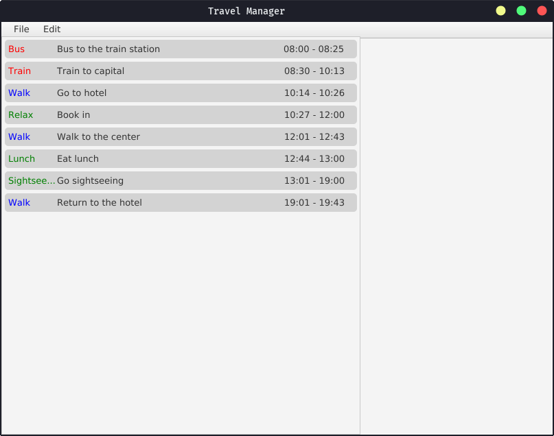

# Travel Manager
*A Java application for planning your journeys and vacations*

## Guide
You can use the menu bar to interact with a current plan you're making.
You can save and load plans saved previously on the hard drive using a SQLite database.
The events added to the plan using the menu bar can be added using the editing menu on the right side of the app.

## Installation guide
1. Clone the project.
2. Install all the dependencies using Maven.
3. Compile the project.